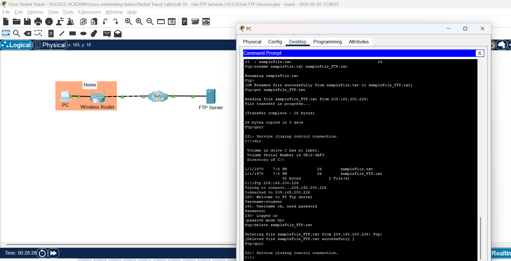

# Lab 10: Gunakan Layanan FTP (Use FTP Services)

**Module:** 16 (Application Layer Services)  
**Topik:** 16.5.3  
**Status:** ✅ Selesai

---

## 📸 Screenshots

| Screenshot | Deskripsi |
|------------|-----------|  
|  | FTP commands di Command Prompt |
|  | Assessment result - Score 1/1 |

---

## 📋 Addressing Table

| Device | Interface | IP Address | Subnet Mask |
|--------|-----------|------------|-------------|
| FTP Server (ftp.pka) | NIC | 209.165.200.226 | 255.255.255.224 |

---

## 📌 Tujuan Lab

- Upload file ke FTP server
- Download file dari FTP server
- Mengenal FTP commands (put, get, rename, delete)

---

## 📋 Latar Belakang

**FTP (File Transfer Protocol):**
- Aplikasi untuk transfer file antara client dan server
- **Port 21** = Command port (koneksi & kontrol)
- **Port 20** = Data port (transfer file)
- Memerlukan **authentication** (username & password)

---

## 🔧 Hasil Praktik

### Part 1: Upload File ke FTP Server

#### Step 1: Cari File di PC

```cmd
C:\> dir

 Volume in drive C has no label.
 Volume Serial Number is 5E12-4AF3
 Directory of C:\

1/1/1970    7:0 PM             26        sampleFile.txt      
                26 bytes            1 File(s)
```

#### Step 2: Koneksi ke FTP Server

```cmd
C:\> ftp 209.165.200.226
Trying to connect...209.165.200.226
Connected to 209.165.200.226
220- Welcome to PT Ftp server
Username: student
331- Username ok, need password
Password: class
230- Logged in
(passive mode On)
```

#### Step 3: Lihat Commands yang Tersedia

```cmd
ftp> ?
         ?
         cd
         delete
         dir
         get
         help
         passive
         put
         pwd
         quit
         rename
```

#### Step 4: Lihat Isi Server & Upload File

```cmd
ftp> dir

Listing /ftp directory from 209.165.200.226: 
0   : asa842-k8.bin                      5571584
1   : asa923-k8.bin                      30468096
... (banyak IOS files)
32  : pt3000-i6q4l2-mz.121-22.EA4.bin    3117390

ftp> put sampleFile.txt

Writing file sampleFile.txt to 209.165.200.226: 
File transfer in progress...
[Transfer complete - 26 bytes]
26 bytes copied in 0.088 secs (295 bytes/sec)
```

**Verifikasi:** `dir` lagi → file `sampleFile.txt` sudah ada di server (index 33)

---

### Part 2: Download File dari FTP Server

#### Step 1: Rename File di Server

```cmd
ftp> rename sampleFile.txt sampleFile_FTP.txt

Renaming sampleFile.txt
[OK Renamed file successfully from sampleFile.txt to sampleFile_FTP.txt]
```

#### Step 2: Download File

```cmd
ftp> get sampleFile_FTP.txt

Reading file sampleFile_FTP.txt from 209.165.200.226: 
File transfer in progress...
[Transfer complete - 26 bytes]
26 bytes copied in 0 secs
```

#### Step 3: Keluar & Verifikasi di PC

```cmd
ftp> quit
221- Service closing control connection.

C:\> dir

 Volume in drive C has no label.
 Volume Serial Number is 5E12-4AF3
 Directory of C:\

1/1/1970    7:0 PM             26        sampleFile.txt      
1/1/1970    7:0 PM             26        sampleFile_FTP.txt  
                52 bytes            2 File(s)
```

✅ File `sampleFile_FTP.txt` sudah ada di PC!

---

### Part 3: Delete File dari Server

```cmd
C:\> ftp 209.165.200.226
...
230- Logged in
(passive mode On)

ftp> delete sampleFile_FTP.txt

Deleting file sampleFile_FTP.txt from 209.165.200.226:
[Deleted file sampleFile_FTP.txt successfully]

ftp> quit
221- Service closing control connection.
```

---

## 📊 FTP Commands Summary

| Command | Fungsi | Contoh |
|---------|--------|--------|
| `ftp <IP>` | Koneksi ke FTP server | `ftp 209.165.200.226` |
| `dir` | List isi directory server | `dir` |
| `pwd` | Print working directory | `pwd` |
| `cd` | Change directory | `cd /folder` |
| `put` | **Upload** file ke server | `put file.txt` |
| `get` | **Download** file dari server | `get file.txt` |
| `rename` | Rename file di server | `rename old.txt new.txt` |
| `delete` | Hapus file di server | `delete file.txt` |
| `quit` | Keluar dari FTP | `quit` |

---

## ❓ Pertanyaan Lab

**Q: Command apa untuk menghapus file dari FTP server?**
> `delete sampleFile_FTP.txt`

---

## 💡 Pemahaman & Poin Penting

### Konsep Utama:

1. **FTP** = File Transfer Protocol (TCP port 20 & 21)
2. **Port 21** = Control/command connection
3. **Port 20** = Data transfer
4. **Authentication** diperlukan (username + password)
5. **put** = upload, **get** = download

### FTP Workflow:

```
┌─────┐                              ┌────────────┐
│ PC  │                              │ FTP Server │
└──┬──┘                              └─────┬──────┘
   │                                       │
   │ ──── ftp 209.165.200.226 ───────────► │ Port 21
   │ ◄─── 220 Welcome ─────────────────── │
   │ ──── USER student ──────────────────► │
   │ ◄─── 331 Need password ────────────── │
   │ ──── PASS class ────────────────────► │
   │ ◄─── 230 Logged in ────────────────── │
   │                                       │
   │ ──── put sampleFile.txt ────────────► │ Port 20
   │ ◄─── Transfer complete ────────────── │
   │                                       │
   │ ──── quit ──────────────────────────► │
   │ ◄─── 221 Goodbye ──────────────────── │
```

### Kesimpulan:
- FTP sangat berguna untuk transfer file jarak jauh
- **IOS images** di server biasanya untuk upgrade router/switch
- FTP **tidak terenkripsi** → data bisa di-sniff

