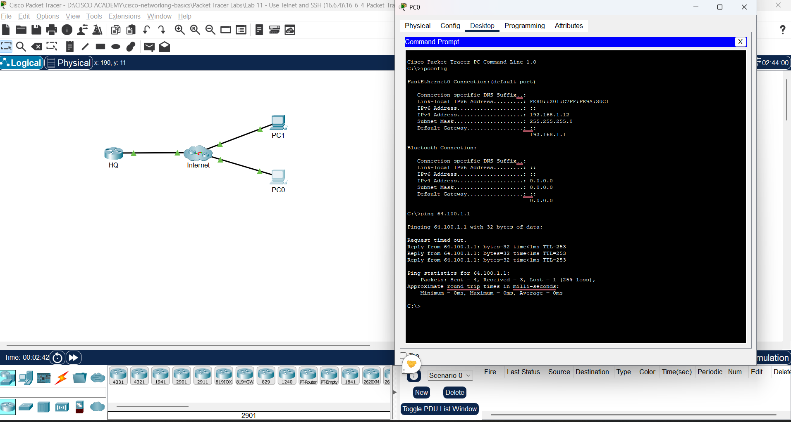
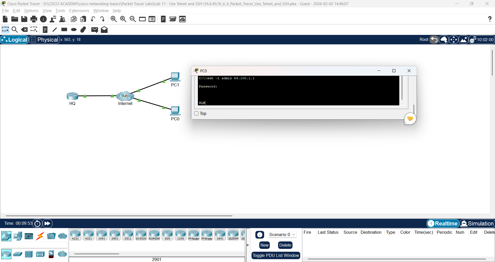

# Lab 11: Gunakan Telnet dan SSH (Use Telnet and SSH)

**Module:** 16 (Application Layer Services)  
**Topik:** 16.6.4  
**Status:** ✅ Selesai

---

## � Screenshots

| Screenshot | Deskripsi |
|------------|-----------|  
|  | Verifikasi IP dan ping ke router HQ |
|  | SSH berhasil login ke router |

---

## �📋 Addressing Table

| Device | Interface | IP Address | Subnet Mask |
|--------|-----------|------------|-------------|
| HQ | G0/0/1 | 64.100.1.1 | 255.255.255.0 |
| PC0 | NIC | DHCP | - |
| PC1 | NIC | DHCP | - |

---

## 📌 Tujuan Lab

- Verifikasi konektivitas ke remote router
- Akses remote device menggunakan Telnet
- Akses remote device menggunakan SSH
- Memahami perbedaan keamanan Telnet vs SSH

---

## 🔧 Hasil Praktik

### Part 1: Verifikasi Konektivitas

#### Step 1: Verifikasi IP Address di PC

```cmd
C:\> ipconfig

FastEthernet0 Connection:(default port)

   Connection-specific DNS Suffix..: 
   Link-local IPv6 Address.........: FE80::...
   IPv6 Address....................: ::
   IPv4 Address....................: 64.100.1.x
   Subnet Mask.....................: 255.255.255.0
   Default Gateway.................: 64.100.1.1
```

**Q: Command apa untuk verifikasi IP dari DHCP?**
> `ipconfig`

#### Step 2: Verifikasi Koneksi ke Router HQ

```cmd
C:\> ping 64.100.1.1

Pinging 64.100.1.1 with 32 bytes of data:

Request timed out.
Reply from 64.100.1.1: bytes=32 time<1ms TTL=253
Reply from 64.100.1.1: bytes=32 time<1ms TTL=253
Reply from 64.100.1.1: bytes=32 time<1ms TTL=253

Ping statistics for 64.100.1.1:
    Packets: Sent = 4, Received = 3, Lost = 1 (25% loss)
```

✅ Koneksi berhasil (3/4 packets received)

---

### Part 2: Akses Remote Device

#### Step 1: Telnet ke HQ

```cmd
C:\> telnet 64.100.1.1
Trying 64.100.1.1 ...Open

[Connection to 64.100.1.1 closed by foreign host]
```

**Q: Apakah berhasil?**
> ❌ **TIDAK** - Koneksi langsung ditutup oleh router

**Alasan:** Router dikonfigurasi untuk **menolak** akses Telnet karena tidak aman (plain text).

#### Step 2: SSH ke HQ

```cmd
C:\> ssh -l admin 64.100.1.1

Password: class

HQ#
```

**Q: Prompt setelah berhasil login via SSH?**
> `HQ#` (privileged EXEC mode)

✅ SSH berhasil! Sekarang kita bisa mengkonfigurasi router secara remote.

---

## 📊 Perbandingan Telnet vs SSH

| Aspek | Telnet | SSH |
|-------|--------|-----|
| **Port** | 23 | 22 |
| **Enkripsi** | ❌ Tidak ada (plain text) | ✅ Terenkripsi |
| **Password** | Dikirim plain text | Terenkripsi |
| **Keamanan** | ❌ Tidak aman | ✅ Aman |
| **Hasil Lab** | ❌ Ditolak | ✅ Berhasil |

---

## 📝 SSH Command Syntax

```
ssh -l <username> <IP_address>
```

| Parameter | Deskripsi |
|-----------|-----------|
| `-l` | Login name (username) |
| `admin` | Username yang dikonfigurasi di router |
| `64.100.1.1` | IP address router |

**Contoh:**
```cmd
C:\> ssh -l admin 64.100.1.1
Password: class
HQ#
```

---

## 💡 Pemahaman & Poin Penting

### Konsep Utama:

1. **Telnet (Port 23)** = Remote access **TIDAK terenkripsi**
2. **SSH (Port 22)** = Remote access **terenkripsi**
3. Router modern **disable Telnet** by default untuk keamanan
4. **SSH** adalah standar untuk remote management

### Kenapa Telnet Berbahaya?

```
┌─────┐          ┌──────────┐          ┌────────┐
│ PC  │ ──────── │ Attacker │ ──────── │ Router │
└─────┘          │ (Sniff)  │          └────────┘
                 └──────────┘
                      │
              Password: class
              (TERLIHAT JELAS!)
```

Dengan **SSH**, semua data terenkripsi → attacker tidak bisa baca.

### Workflow Remote Access:

```
┌─────┐                              ┌────────┐
│ PC  │                              │ Router │
└──┬──┘                              └───┬────┘
   │                                     │
   │ ──── SSH connection (port 22) ────► │
   │ ◄─── Encrypted handshake ────────── │
   │ ──── Username: admin ─────────────► │ (encrypted)
   │ ──── Password: class ─────────────► │ (encrypted)
   │ ◄─── HQ# prompt ─────────────────── │
   │                                     │
   │      (Secure remote management)     │
```

### Kesimpulan:
- **SELALU gunakan SSH** untuk remote access
- Telnet sudah **obsolete** dan tidak aman
- Best practice: disable Telnet di semua network devices

### Relevansi CyberSec:
- ⚠️ Telnet = **vulnerability** (CVE terkait banyak)
- SSH brute force attack masih mungkin → gunakan strong password
- Key-based authentication lebih aman dari password
- Port 22 sering di-scan oleh attacker
