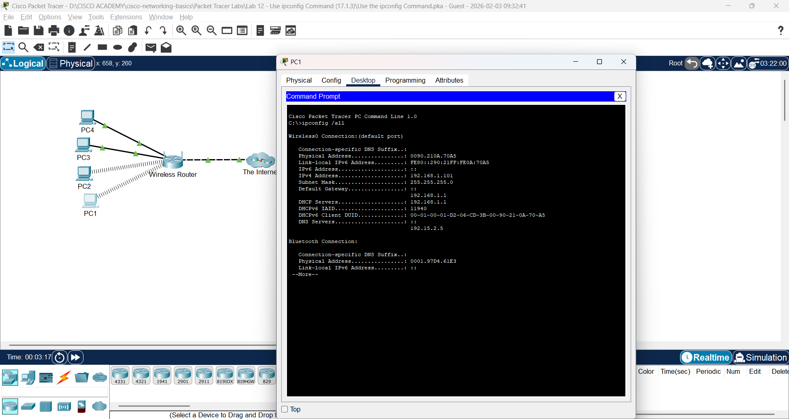
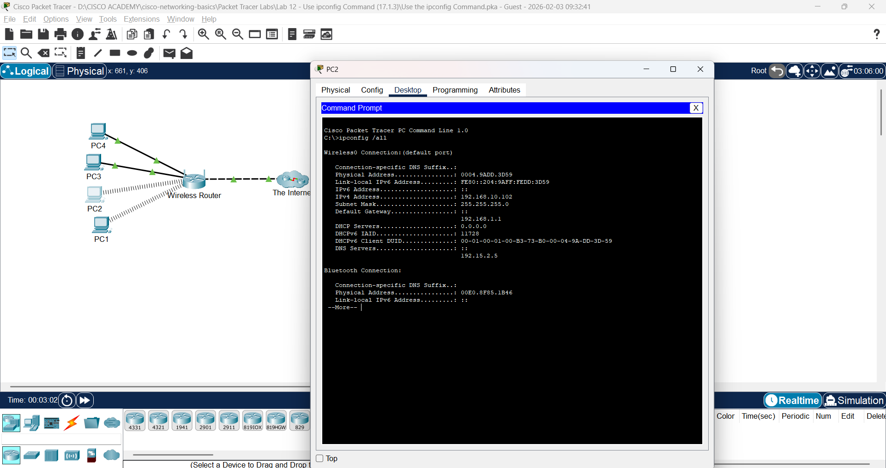
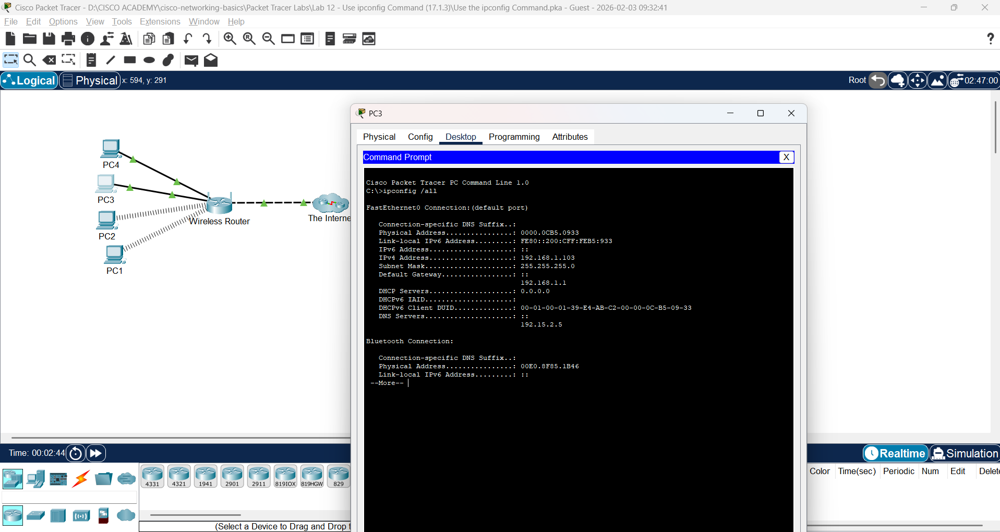
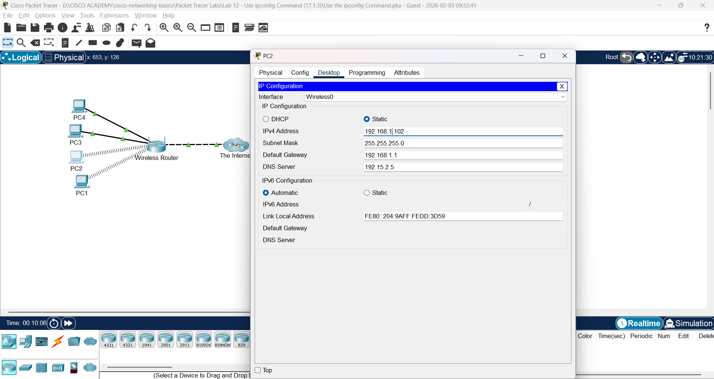
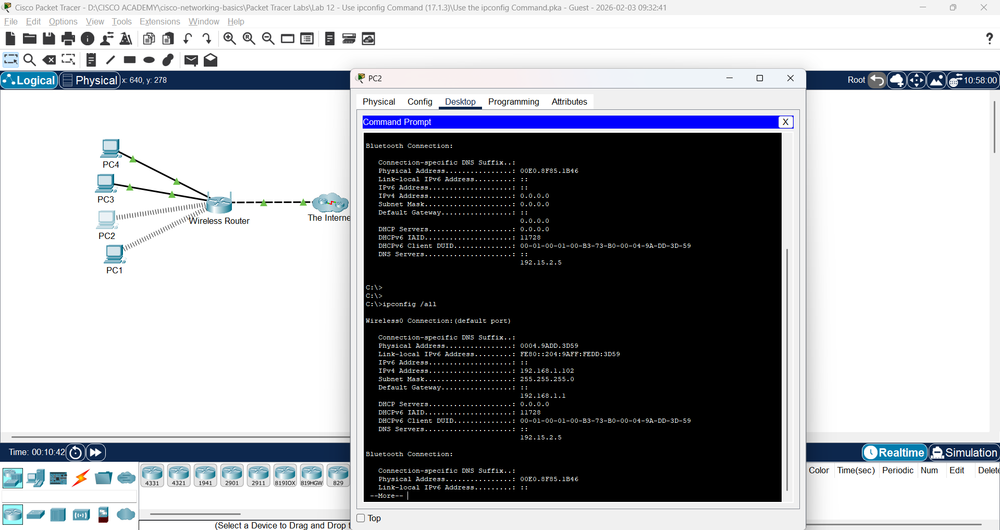

# Lab 12: Gunakan Perintah ipconfig

**Module:** 17 (Network Testing Utilities)  
**Topik:** 17.1.3  
**Status:** ✅ Selesai

---

## 📌 Tujuan Lab

Menggunakan perintah `ipconfig` untuk mengidentifikasi konfigurasi yang salah pada PC.

### Skenario

Pemilik bisnis kecil tidak dapat terhubung ke internet dengan salah satu dari empat PC di kantor. Semua PC dikonfigurasi dengan static IP addressing menggunakan network **192.168.1.0 /24**. PC-PC tersebut seharusnya dapat mengakses webserver **www.cisco.pka**. Gunakan perintah `ipconfig /all` untuk mengidentifikasi PC mana yang salah konfigurasinya.

---

## 🔧 Hasil Praktik

### Part 1: Verify Configurations

Mengakses Command Prompt pada setiap PC dan menjalankan perintah `ipconfig /all`.

#### PC1 - Konfigurasi ✅ Benar

#### PC2 - Konfigurasi ❌ Salah (Sebelum Perbaikan)

#### PC3 - Konfigurasi ✅ Benar

#### PC4 - Konfigurasi ✅ Benar

### Part 2: Correct Any Misconfigurations

**PC yang salah konfigurasinya: PC2**

#### Proses Perbaikan
Mengakses **Desktop tab > IP Configuration** pada PC2 untuk memperbaiki konfigurasi.

#### Hasil Setelah Perbaikan

---

## 💡 Pemahaman & Learning Outcomes

### Perintah `ipconfig /all`
Perintah ini menampilkan informasi lengkap konfigurasi IP pada PC Windows, termasuk:
- **IP Address** - Alamat IP yang dikonfigurasi
- **Subnet Mask** - Menentukan porsi network dan host
- **Default Gateway** - Router yang digunakan untuk keluar dari network lokal
- **DNS Server** - Server untuk resolusi nama domain

### Pentingnya Konfigurasi yang Benar
Untuk PC dapat berkomunikasi dalam network 192.168.1.0/24:
- IP Address harus dalam range **192.168.1.1 - 192.168.1.254**
- Subnet Mask harus **255.255.255.0** (/24)
- Default Gateway harus mengarah ke router (biasanya **192.168.1.1**)
- Setiap PC harus memiliki IP Address yang **unik** (tidak boleh duplikat)

### Troubleshooting dengan ipconfig
- `ipconfig` - Menampilkan konfigurasi IP dasar
- `ipconfig /all` - Menampilkan informasi lengkap termasuk MAC address, DNS, dan DHCP status
- `ipconfig /release` - Melepas konfigurasi IP dari DHCP
- `ipconfig /renew` - Meminta konfigurasi IP baru dari DHCP

---

**Catatan:** Lab selesai dikerjakan ✅
