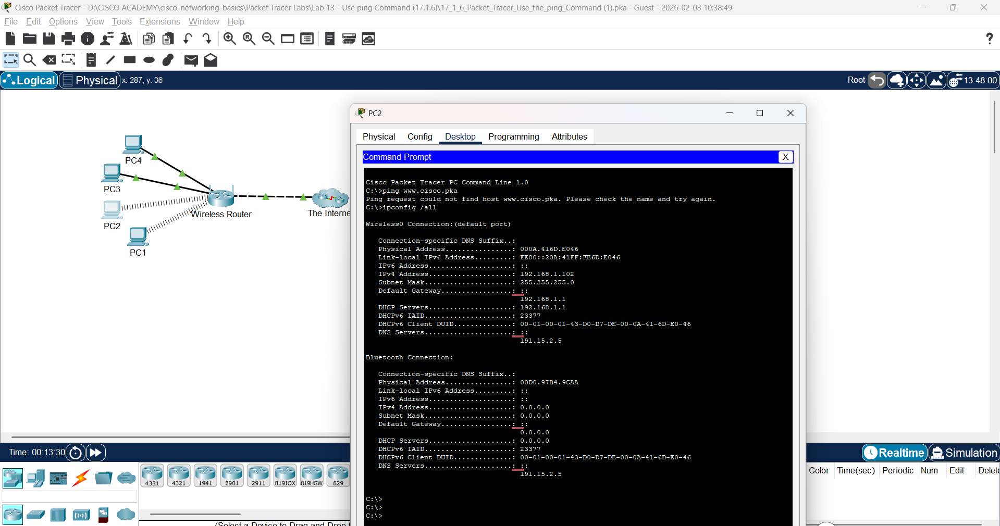
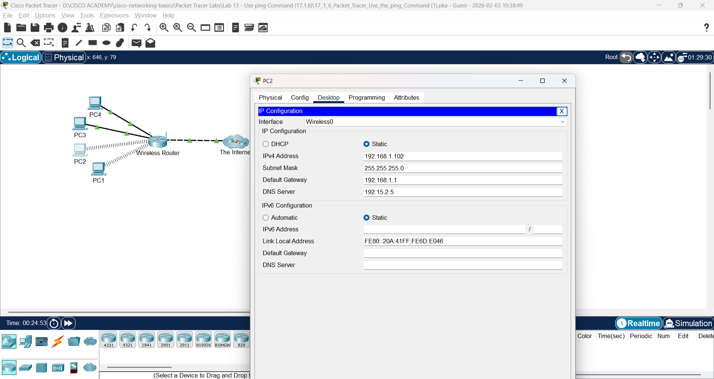
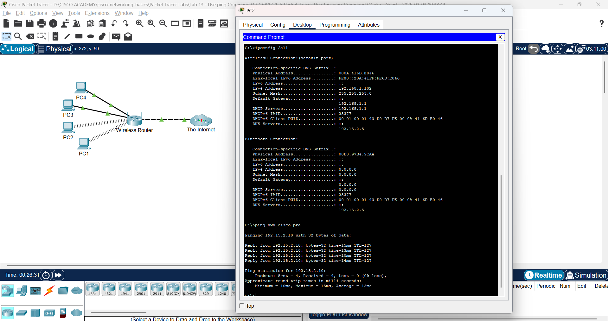

# Lab 13: Gunakan Perintah ping

**Module:** 17 (Network Testing Utilities)  
**Topik:** 17.1.6  
**Status:** ✅ Selesai

---

## 📌 Tujuan Lab

Menggunakan perintah `ping` untuk mengidentifikasi konfigurasi yang salah pada PC.

### Skenario

Pemilik bisnis kecil mengetahui bahwa beberapa pengguna tidak dapat mengakses website. Semua PC dikonfigurasi dengan static IP addressing. Gunakan perintah `ping` untuk mengidentifikasi masalahnya.

---

## 🔧 Hasil Praktik

### Part 1: Verify Connectivity

Mengakses **Desktop tab > Web Browser** pada setiap PC dan memasukkan URL `www.cisco.pka`.

**Question:** Which PCs are unable to connect to the web server?

**Answer:** **PC2** tidak dapat terhubung ke web server.

---

### Part 2: Ping the Web Server from PC with Connectivity Issues

Mengakses Command Prompt pada PC2 dan menjalankan `ping www.cisco.pka`.



**Question:** Did the ping return a reply? What is the IP address displayed in the reply, if any?

**Answer:**
```
C:\> ping www.cisco.pka
Ping request could not find host www.cisco.pka. Please check the name and try again.
```

❌ Ping **tidak** mengembalikan reply. Tidak ada IP address yang ditampilkan karena DNS resolution gagal.

---

### Part 3: Ping the Web Server from Correctly Configured PCs

Mengakses Command Prompt pada PC yang terkonfigurasi dengan benar dan menjalankan `ping www.cisco.pka`.

**Question:** Did the ping return a reply? What is the IP address returned, if any?

**Answer:**
```
C:\>ping www.cisco.pka

Pinging 192.15.2.10 with 32 bytes of data:

Reply from 192.15.2.10: bytes=32 time=12ms TTL=127
Reply from 192.15.2.10: bytes=32 time=10ms TTL=127
Reply from 192.15.2.10: bytes=32 time=13ms TTL=127
Reply from 192.15.2.10: bytes=32 time=13ms TTL=127

Ping statistics for 192.15.2.10:
Packets: Sent = 4, Received = 4, Lost = 0 (0% loss),
Approximate round trip times in milli-seconds:
Minimum = 10ms, Maximum = 13ms, Average = 12ms
```

✅ Ping berhasil! IP address web server adalah **192.15.2.10**.

---

### Part 4: Ping the IP Address of the Web Server from PCs with Connectivity Issues

Mencoba ping langsung ke IP address web server dari PC2.

**Result:** Ping ke **192.15.2.10** berhasil, yang berarti PC2 dapat mencapai web server via IP address, tetapi tidak via domain name.

**Kesimpulan:** Masalah kemungkinan ada pada konfigurasi **DNS server** di PC2.

---

### Part 5: Compare the DNS Server Information on the PCs

Menggunakan perintah `ipconfig /all` untuk membandingkan konfigurasi DNS server.

**Question:** Do the two configurations match?

**Answer:** **No** - Konfigurasi DNS server pada PC2 berbeda/salah dibandingkan dengan PC yang berfungsi normal.

---

### Part 6: Make Any Necessary Configuration Changes on the PCs

1. Navigasi ke **Desktop tab > IP Configuration** pada PC2
2. Memperbaiki konfigurasi **DNS Server** agar sama dengan PC lain yang berfungsi
3. Verifikasi dengan mengakses `www.cisco.pka` melalui Web Browser





✅ Setelah perbaikan, PC2 berhasil mengakses website.

---

## 💡 Pemahaman & Learning Outcomes

### Perintah `ping`
Perintah `ping` digunakan untuk:
- Menguji konektivitas jaringan ke host tertentu
- Mengukur latency (round-trip time)
- Mendeteksi packet loss
- Memverifikasi DNS resolution (saat ping menggunakan domain name)

### Analisis Troubleshooting

| Gejala | Kemungkinan Penyebab |
|--------|---------------------|
| "Could not find host" | DNS server tidak dikonfigurasi atau salah |
| "Request timed out" | Host tidak dapat dijangkau, firewall, atau kabel terputus |
| "Destination unreachable" | Routing problem atau host down |
| Ping IP berhasil, ping domain gagal | Masalah DNS configuration |

### Langkah Troubleshooting yang Dipelajari

1. **Verifikasi konektivitas** - Coba akses website dari semua PC
2. **Ping domain name** - Identifikasi apakah DNS resolution berfungsi
3. **Ping IP address** - Isolasi masalah (DNS vs network connectivity)
4. **Bandingkan konfigurasi** - Gunakan `ipconfig /all` untuk membandingkan setting
5. **Perbaiki konfigurasi** - Sesuaikan setting yang salah
6. **Verifikasi perbaikan** - Test ulang konektivitas

### Key Takeaway

> Jika ping ke **domain name gagal** tetapi ping ke **IP address berhasil**, masalahnya ada pada **DNS configuration**, bukan network connectivity.

---

**Catatan:** Lab selesai dikerjakan ✅
