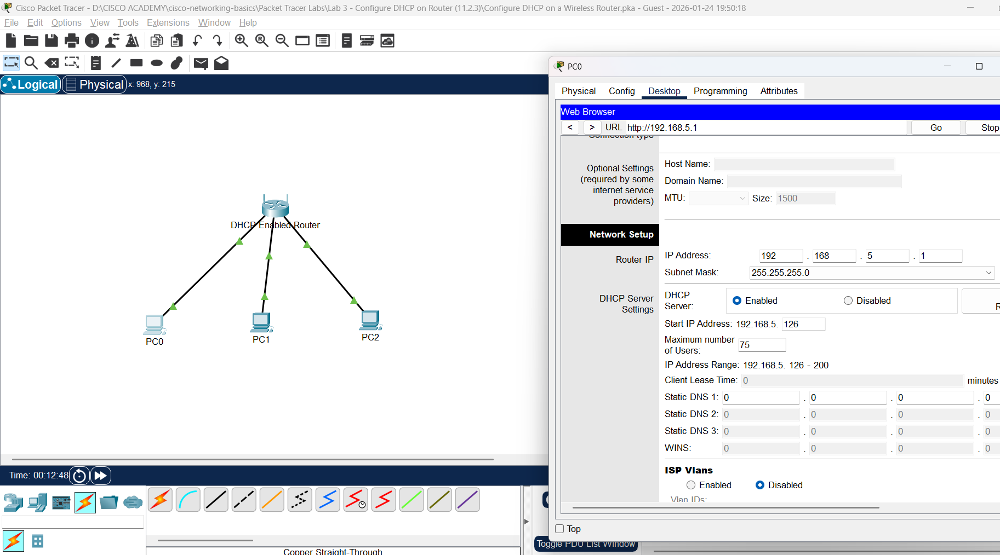
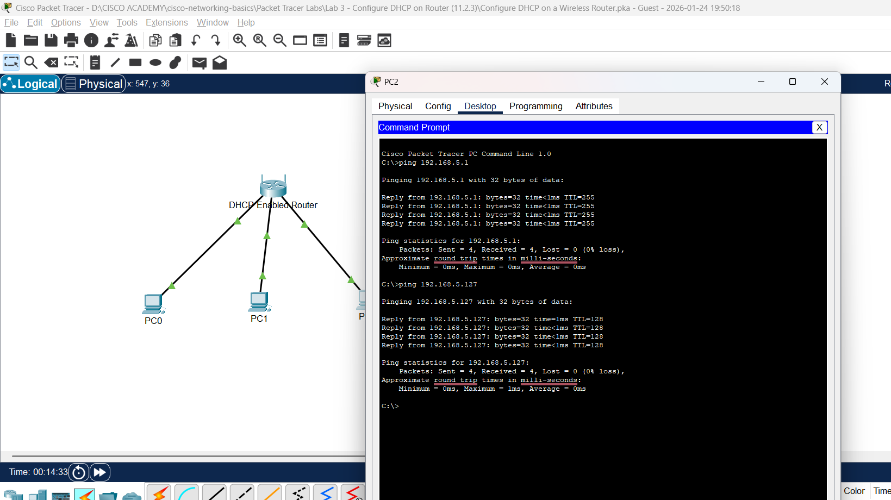
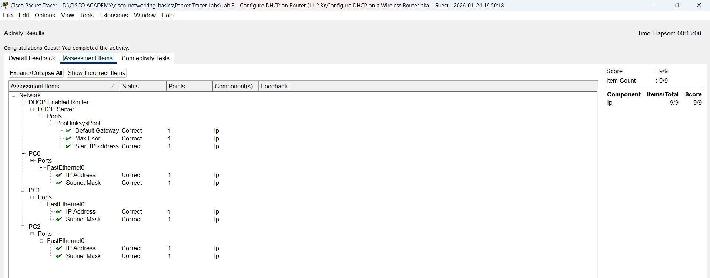

# Lab 3: Configure DHCP on a Wireless Router (11.2.3)

**Lab:** Packet Tracer - Configure DHCP on a Wireless Router  
**Modul:** 11.2.3 - DHCPv4 Configuration  
**Tanggal:** 24 Januari 2026  
**Status:** ✅ Selesai (Score: 9/9)

---

## 📋 Objectives

1. Connect 3 PCs to a wireless router
2. Change the DHCP setting to a specific network range
3. Configure the clients to obtain their address via DHCP

---

## 🔧 Topologi Jaringan

```
                    ┌──────────────────────┐
                    │  DHCP Enabled Router │
                    │    192.168.5.1       │
                    └──────────┬───────────┘
                               │
              ┌────────────────┼────────────────┐
              │                │                │
         ┌────┴────┐      ┌────┴────┐      ┌────┴────┐
         │   PC0   │      │   PC1   │      │   PC2   │
         │ .126    │      │ .127    │      │ .128    │
         └─────────┘      └─────────┘      └─────────┘
```

**Network:** 192.168.5.0/24  
**DHCP Range:** 192.168.5.126 - 192.168.5.200

---

## 📝 Langkah Praktikum

### Part 1: Set Up Network Topology

1. Tambahkan 3 generic PCs ke workspace
2. Hubungkan setiap PC ke port Ethernet router menggunakan kabel **straight-through**

---

### Part 2: Observe Default DHCP Settings

1. Klik **PC0** → Tab **Desktop** → **IP Configuration**
2. Pilih **DHCP** untuk mendapat IP otomatis
3. Catat IP default gateway: `192.168.0.1`
4. Buka **Web Browser** → masukkan IP gateway
5. Login: `admin` / `admin`
6. Perhatikan setting default DHCP

---

### Part 3: Change Default IP of Wireless Router

**Konfigurasi:**
| Parameter | Nilai |
|-----------|-------|
| Router IP Address | 192.168.5.1 |
| Subnet Mask | 255.255.255.0 |

**Langkah:**
1. Di **Router IP Settings** → ubah IP ke `192.168.5.1`
2. Scroll ke bawah → klik **Save Settings**
3. Web page akan error (normal karena IP berubah)
4. Tutup browser
5. Kembali ke **IP Configuration** → klik **Static** → klik **DHCP** (untuk renew IP)
6. Buka browser → akses `192.168.5.1`
7. Login kembali: `admin` / `admin`

---

### Part 4: Change DHCP Range

**Konfigurasi:**

| Parameter | Nilai Default | Nilai Baru |
|-----------|---------------|------------|
| Start IP Address | 192.168.5.100 | **192.168.5.126** |
| Maximum Number of Users | 50 | **75** |
| IP Address Range | - | 192.168.5.126 - 200 |

**Langkah:**
1. Ubah **Starting IP Address** ke `192.168.5.126`
2. Ubah **Maximum Number of Users** ke `75`
3. Klik **Save Settings**
4. Tutup browser
5. Renew IP di PC0 (Static → DHCP)



---

### Part 5: Enable DHCP on Other PCs

**PC1:**
1. Klik **PC1** → Tab **Desktop** → **IP Configuration**
2. Pilih **DHCP**
3. IP Address: `192.168.5.127`

**PC2:**
1. Klik **PC2** → Tab **Desktop** → **IP Configuration**
2. Pilih **DHCP**
3. IP Address: `192.168.5.128`

---

### Part 6: Verify Connectivity

**Dari PC2, buka Command Prompt:**

```
C:\>ipconfig
(Verifikasi IP configuration)

C:\>ping 192.168.5.1
Pinging 192.168.5.1 with 32 bytes of data:
Reply from 192.168.5.1: bytes=32 time<1ms TTL=255
Reply from 192.168.5.1: bytes=32 time<1ms TTL=255
Reply from 192.168.5.1: bytes=32 time<1ms TTL=255
Reply from 192.168.5.1: bytes=32 time<1ms TTL=255
Ping statistics: Sent = 4, Received = 4, Lost = 0 (0% loss)

C:\>ping 192.168.5.127
Pinging 192.168.5.127 with 32 bytes of data:
Reply from 192.168.5.127: bytes=32 time<1ms TTL=128
Reply from 192.168.5.127: bytes=32 time<1ms TTL=128
Reply from 192.168.5.127: bytes=32 time<1ms TTL=128
Reply from 192.168.5.127: bytes=32 time<1ms TTL=128
Ping statistics: Sent = 4, Received = 4, Lost = 0 (0% loss)
```



---

## ✅ Hasil Assessment

**Score: 9/9 (100%)**

| Component | Item | Status |
|-----------|------|--------|
| **DHCP Enabled Router** | Default Gateway | ✅ Correct |
| | Max User | ✅ Correct |
| | Start IP Address | ✅ Correct |
| **PC0** | IP Address | ✅ Correct |
| | Subnet Mask | ✅ Correct |
| **PC1** | IP Address | ✅ Correct |
| | Subnet Mask | ✅ Correct |
| **PC2** | IP Address | ✅ Correct |
| | Subnet Mask | ✅ Correct |



---

## 📊 IP Assignment Summary

| Device | IP Address | Method |
|--------|------------|--------|
| Router | 192.168.5.1 | Static (configured) |
| PC0 | 192.168.5.126 | DHCP |
| PC1 | 192.168.5.127 | DHCP |
| PC2 | 192.168.5.128 | DHCP |

---

## 💡 Learning Outcomes

1. **DHCP Server Configuration** - Mengubah range IP dan jumlah maksimum user
2. **IP Renewal** - Cara renew IP setelah perubahan konfigurasi (Static → DHCP)
3. **Connectivity Verification** - Menggunakan ping untuk verifikasi koneksi
4. **Router Web Interface** - Mengakses dan mengkonfigurasi router via browser

---

## 🔗 Referensi

- **Teori:** [Modul 11 - Dynamic Addressing with DHCP](../../notes_modul/modul-11-id.md)
- **Tambahan:** [DHCP Protocol & Attacks](../../notes_modul_tambahan/tambahan-modul-09.md)

---

**Time Elapsed:** 15:00  
**Completed:** 24 Januari 2026
