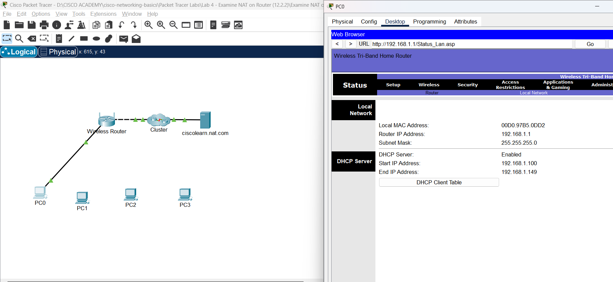
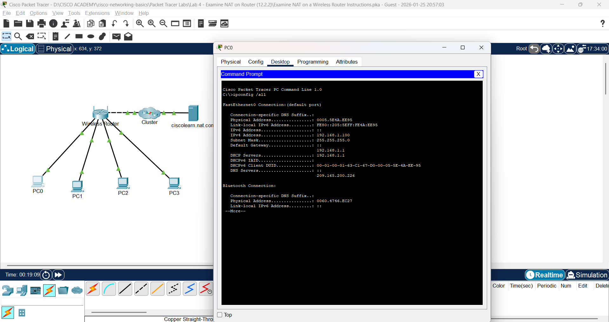
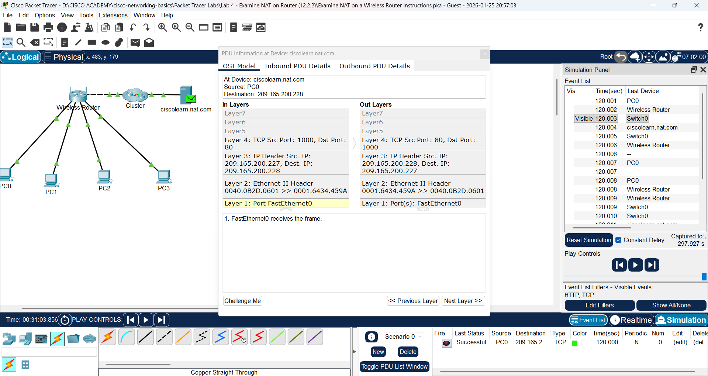
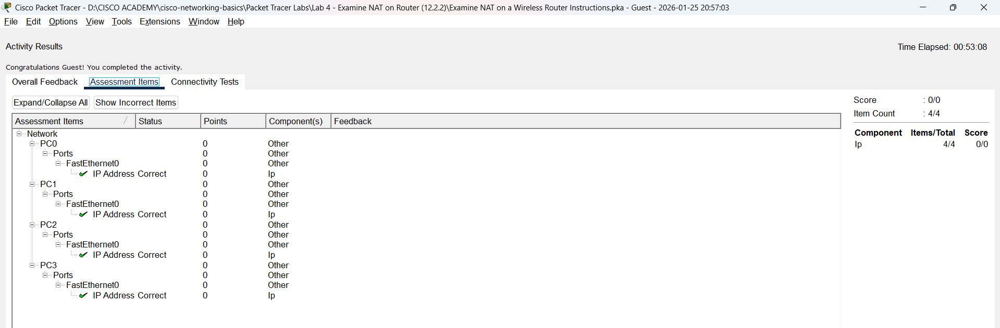

# Lab 4: Examine NAT on a Wireless Router (12.2.2)

**Lab:** Packet Tracer - Examine NAT on a Wireless Router  
**Modul:** 12.2.2 - Network Address Translation  
**Tanggal:** 25 Januari 2026  
**Status:** ✅ Selesai

---

## 📋 Objectives

1. Examine NAT configuration on a wireless router
2. Set up 4 PCs to connect to a wireless router using DHCP
3. Examine traffic that crosses the network using NAT

---

## 🔧 Topologi Jaringan

```
                    ┌─────────────────────┐
                    │  ciscolearn.nat.com │
                    │     Web Server      │
                    └──────────┬──────────┘
                               │
                    ┌──────────┴──────────┐
                    │      INTERNET       │
                    │    (ISP + DHCP)     │
                    └──────────┬──────────┘
                               │
                    External: Public IP (dari ISP)
                    ┌──────────┴──────────┐
                    │   Wireless Router   │
                    │   NAT + DHCP Server │
                    └──────────┬──────────┘
                    Internal: 192.168.0.1
                               │
        ┌──────────┬───────────┼───────────┬──────────┐
        │          │           │           │          │
   ┌────┴────┐ ┌───┴────┐ ┌────┴────┐ ┌────┴────┐
   │   PC0   │ │  PC1   │ │   PC2   │ │   PC3   │
   │  .100   │ │  .101  │ │   .102  │ │   .103  │
   └─────────┘ └────────┘ └─────────┘ └─────────┘
```

**Internal Network:** 192.168.0.0/24 (Private)  
**External Network:** Public IP dari ISP

---

## 📝 Langkah Praktikum

### Part 1: Examine Configuration for Accessing External Network

**1. Setup PC dan koneksi:**
- Tambahkan 1 PC ke workspace
- Hubungkan ke wireless router dengan kabel **straight-through**
- Tunggu semua lampu link menjadi hijau

**2. Konfigurasi DHCP pada PC:**
- Klik PC → **Desktop** → **IP Configuration**
- Pilih **DHCP**
- Catat default gateway: `192.168.0.1`

**3. Akses Router Configuration:**
- Buka **Web Browser** → masukkan `192.168.0.1`
- Login: `admin` / `admin`
- Klik menu **Status** → **Router**

**4. Internet Connection IP:**

| Parameter | Value |
|-----------|-------|
| IP Address (External) | Dari ISP (Public) |
| Tipe | **Public IP Address** |

> **Jawaban:** IP dari ISP adalah **Public IP Address** karena digunakan untuk routing di internet

---

### Part 2: Examine Configuration for Accessing Internal Network

**1. Lihat Local Network Settings:**
- Klik **Local Network** dalam Status sub-menu
- Scroll down untuk lihat informasi Local Network



**2. DHCP Server Information:**

| Parameter | Value |
|-----------|-------|
| Router IP (Internal) | 192.168.0.1 |
| Subnet Mask | 255.255.255.0 |
| DHCP Server | Enabled |
| Start IP Address | 192.168.0.100 |
| Maximum Users | 50 |
| IP Range | 192.168.0.100 - 192.168.0.149 |

> **Jawaban:** IP di internal network adalah **Private IP Address** (192.168.x.x range)

---

### Part 3: Connect 3 PCs to the Wireless Router

**1. Tambahkan 3 PC lagi:**
- Hubungkan masing-masing ke wireless router
- Tunggu link lights menjadi hijau

**2. Konfigurasi DHCP pada setiap PC:**

| PC | IP Address | Subnet Mask | Default Gateway |
|----|------------|-------------|-----------------|
| PC0 | 192.168.0.100 | 255.255.255.0 | 192.168.0.1 |
| PC1 | 192.168.0.101 | 255.255.255.0 | 192.168.0.1 |
| PC2 | 192.168.0.102 | 255.255.255.0 | 192.168.0.1 |
| PC3 | 192.168.0.103 | 255.255.255.0 | 192.168.0.1 |

**3. Verifikasi dengan ipconfig /all:**

```
C:\>ipconfig /all

FastEthernet0 Connection:(default port)
   Physical Address................: 0001.C7D7.2135
   IP Address......................: 192.168.0.100
   Subnet Mask.....................: 255.255.255.0
   Default Gateway.................: 192.168.0.1
   DNS Server......................: 0.0.0.0
   DHCP Server.....................: 192.168.0.1
```



> **Note:** Private addresses tidak bisa langsung cross internet, maka **NAT translation harus terjadi**!

---

### Part 4: View NAT Translation Across the Wireless Router

**1. Masuk Simulation Mode:**
- Klik tab **Simulation** (di pojok kanan bawah)
- Klik **Show All/None** untuk clear filters
- Klik **Edit Filters** → tab **Misc** → centang **TCP** dan **HTTP**

**2. Buat Complex PDU:**
- Klik ikon **envelope terbuka** di toolbar atas
- Klik salah satu PC sebagai **source**
- Konfigurasi Complex PDU:

| Setting | Value |
|---------|-------|
| Application | HTTP |
| Destination | ciscolearn.nat.com |
| Source Port | 1000 |
| Simulation Settings | Periodic |
| Interval | 120 seconds |

- Klik **Create PDU**

**3. Jalankan Simulasi:**
- Klik **Play** di Simulation Panel
- Geser slider ke kanan untuk mempercepat
- Klik **View Previous Events** jika buffer full

---

### Part 5: View Header Information of Packets

**1. Examine Packet Headers:**
- Double-click pada baris ke-3 di Event List
- Klik envelope di workspace untuk lihat packet info

**2. Inbound PDU Details (Sebelum NAT):**

| Field | Value |
|-------|-------|
| Source IP | 192.168.0.100 (Private) |
| Destination IP | [IP Server] |

**3. Outbound PDU Details (Setelah NAT):**



| Field | Value |
|-------|-------|
| Source IP | [Public IP dari ISP] |
| Destination IP | [IP Server] |

> **Perhatikan perubahan SRC IP Address!**
> - **Sebelum NAT:** 192.168.0.100 (Private)
> - **Sesudah NAT:** Public IP dari ISP

---

## ✅ Hasil Assessment

**Status: Completed**



---

## 📊 Tabel Perbandingan: Sebelum vs Sesudah NAT

| Aspek | Sebelum NAT (Internal) | Sesudah NAT (External) |
|-------|------------------------|------------------------|
| Source IP | 192.168.0.100 (Private) | Public IP dari ISP |
| Destination IP | IP Web Server | IP Web Server (sama) |
| Bisa routing di internet? | ❌ Tidak | ✅ Ya |

---

## 💡 Pemahaman & Key Takeaways

### 1. Konsep NAT (Network Address Translation)
```
PC (Private IP) → Router (NAT) → Internet (Public IP)
   192.168.0.100      ↓           Public IP ISP
                 Translation!
```

### 2. Mengapa NAT Diperlukan?
- **Private IP** (192.168.x.x, 10.x.x.x, 172.16-31.x.x) **TIDAK bisa di-route di internet**
- NAT **mengganti** source IP dari private menjadi public
- Memungkinkan **banyak device** berbagi 1 public IP

### 3. Dual Role Wireless Router

| Role | Network Side | IP Type |
|------|--------------|---------|
| **DHCP Server** | Internal (LAN) | Private (192.168.0.x) |
| **DHCP Client** | External (WAN) | Public (dari ISP) |
| **NAT Device** | Boundary | Translasi Private ↔ Public |

### 4. Flow Traffic dengan NAT

```
1. PC0 kirim HTTP request ke web server
2. Source: 192.168.0.100 → Dest: IP Server
3. Packet sampai di router
4. Router lakukan NAT: ganti source 192.168.0.100 → Public IP
5. Packet keluar ke internet dengan Public IP
6. Reply dari server kembali ke Public IP router
7. Router reverse NAT: ganti dest Public IP → 192.168.0.100
8. Packet sampai ke PC0
```

---

## 📚 Konsep Terkait

- **Modul 12.1:** Gateway dan Network Boundary
- **Modul 9:** Private vs Public IP Address
- **Modul 11:** DHCP Configuration
- **Lab 3:** DHCP pada Wireless Router