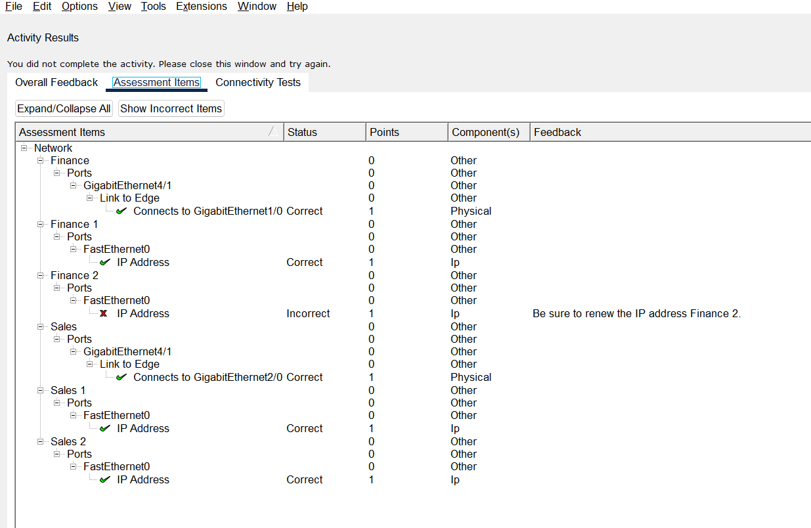
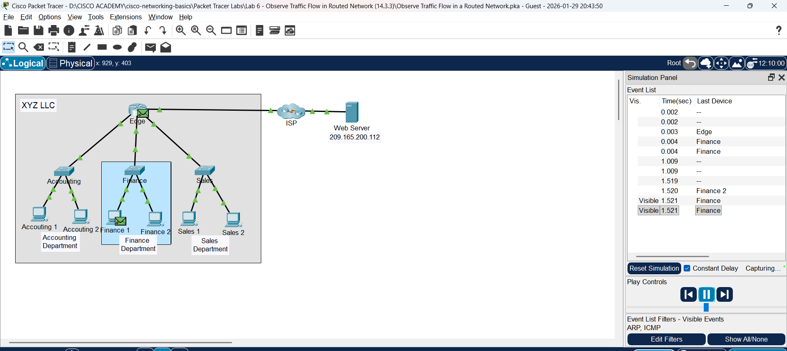

# Lab 6: Amati Aliran Traffic di Routed Network

**Module:** 14 (Routing Between Networks)  
**Topik:** 14.3.3  
**Status:** ✅ Selesai

---

## 📸 Screenshots

| Screenshot | Deskripsi |
|------------|-----------|  
|  | Assessment result - 100% completion |
|  | Network topology dengan 3 departemen |
|  | PDU simulation mode - ARP & ICMP |

---

## �📌 Tujuan Lab

- **Part 1:** Observe Traffic Flow in an Unrouted LAN
- **Part 2:** Reconfigure the Network to Route Between LANs
- **Part 3:** Observe Traffic Flow in the Routed Network

---

## 🔧 Hasil Praktik

### Part 1: Observe Traffic Flow in an Unrouted LAN

**Skenario:** Network XYZ dengan ~150 devices dalam 1 network (192.168.1.0/24)

#### Step 1: Clear ARP Cache
```
C:\> arp -a        (cek ARP cache)
C:\> arp -d        (hapus entries jika ada)
```

#### Step 2: Observe Traffic Flow

**Q: Apa source dan destination MAC/IP saat ping?**
| Field | Value |
|-------|-------|
| Source MAC | 00E0.8FA9.B373 |
| Source IP | 192.168.1.2 |
| Destination MAC | **FFFF.FFFF.FFFF** (Broadcast) |
| Destination IP | 192.168.1.7 |

**Q: Kenapa destination MAC = broadcast?**
> Karena Sales 2 belum punya MAC address Sales 1, jadi kirim **ARP Request** sebagai broadcast dengan IP tujuan.

**Q: Device mana yang proses ARP request?**
> **Semua host di broadcast domain** dan router interfaces.

**Q: Apa dampaknya terhadap efisiensi network?**
> Akan ada proses tambahan jika tidak ada ARP cache - harus ARP request dulu sebelum komunikasi.

**Q: Tipe PDU baru yang muncul?**
> **ICMP** (setelah ARP selesai, baru kirim ping)

---

### Part 2: Reconfigure Network to Route Between LANs

**Perubahan yang dilakukan:**
1. Kabel Accounting switch → Edge router GigabitEthernet 1/0
2. Kabel Finance switch → Edge router GigabitEthernet port lain
3. Hosts renew IP via DHCP: `ipconfig /renew`

**Network Assignment:**
| Department | IPv4 Network |
|------------|--------------|
| Accounting | 192.168.1.0/24 (tetap) |
| Finance | **192.168.2.0/24** |
| Sales | **192.168.3.0/24** |

---

### Part 3: Observe Traffic Flow in Routed Network

**Q: Device mana yang terima ARP broadcast sekarang?**
> Hanya **Sales 1** dan **router interface** yang terhubung ke Sales network.

**Q: Apa benefit menggunakan multiple IPv4 networks/subnets?**
> - Membatasi broadcast domain
> - Meningkatkan kualitas network
> - Traffic lokal lebih ringan
> - Efisiensi meningkat

---

## 📊 Perbandingan: Unrouted vs Routed

| Aspek | Unrouted (1 Network) | Routed (Multiple Networks) |
|-------|---------------------|---------------------------|
| **Broadcast** | Semua device terima | Hanya 1 segment |
| **ARP Request** | Flood ke semua | Terbatas per subnet |
| **Efisiensi** | Rendah (150 devices) | Tinggi |
| **Security** | Kurang (semua bisa lihat) | Lebih baik (segmented) |

---

## 💡 Pemahaman & Learning Outcomes

### Konsep Utama:
1. **Unrouted LAN** = semua device di 1 broadcast domain = tidak efisien
2. **Routed Network** = setiap subnet punya broadcast domain sendiri
3. **ARP broadcast** dibatasi oleh router
4. **Subnetting** meningkatkan efisiensi dan security
