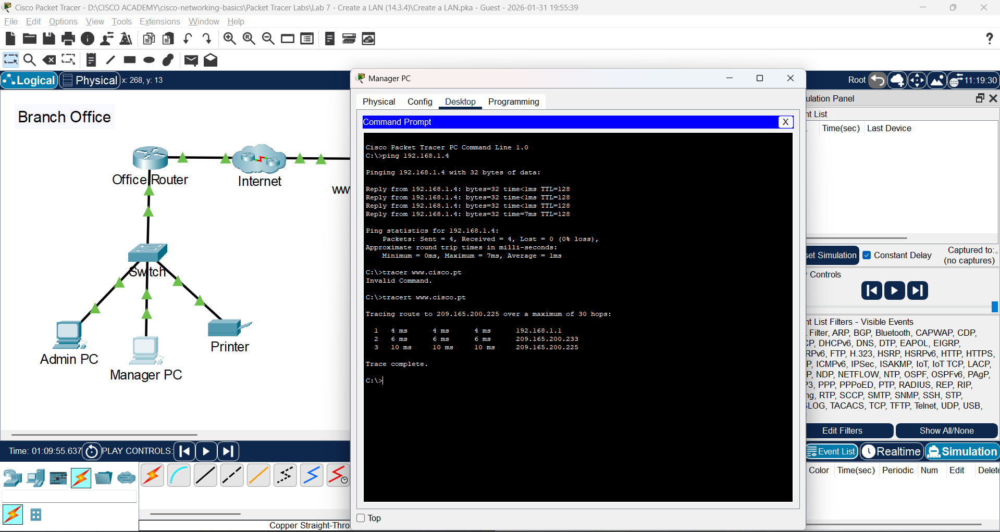

# Lab 7: Buat Jaringan LAN

**Module:** 14 (Routing Between Networks)  
**Topik:** 14.3.4  
**Status:** ✅ Selesai

---

## � Screenshots

| Screenshot | Deskripsi |
|------------|-----------|  
|  | LAN topology dengan Office Router |
|  | Hasil ipconfig command |

---

## �📌 Tujuan Lab

- Connect Network Devices and Hosts
- Configure Devices with IPv4 Addressing
- Verify End Device Configuration and Connectivity
- Use Networking Commands to View Host Information

---

## 📋 Addressing Table

| Device | Interface | IPv4 Address | Subnet Mask |
|--------|-----------|--------------|-------------|
| Admin PC | NIC | DHCP | N/A |
| Manager PC | NIC | DHCP | N/A |
| Printer | NIC | 192.168.1.100 | 255.255.255.0 |
| www.cisco.pt | NIC | 209.165.200.225 | N/A |

---

## 🔧 Hasil Praktik

### Part 1: Connect Network Devices and Hosts

**Connections Table:**
| Device | Interface | Connected to | Interface |
|--------|-----------|--------------|-----------|
| Office Router | G0/0 | ISP1 | G0/0 |
| Office Router | G0/1 | Switch | G0/1 |
| Admin PC | NIC (F/0) | Switch | F0/1 |
| Manager PC | NIC (F/0) | Switch | F0/2 |
| Printer | NIC (F/0) | Switch | F0/24 |

**Kabel:** Copper straight-through untuk semua koneksi

---

### Part 2: Configure Devices with IPv4 Addressing

**PC Configuration:**
- Admin PC & Manager PC → **DHCP** (dapat IP otomatis)
- Printer → **Static IP** (192.168.1.100)

**Q: Kenapa IP address berbeda tapi subnet mask & gateway sama?**
> Setiap device butuh **IP unik** untuk komunikasi. Kalau IP sama, bagaimana bisa dibedakan? Subnet mask dan default gateway sama karena semua di **network yang sama** dan gateway untuk keluar ke network lain.

**Q: Kalau printer perlu default gateway, nilai apa?**
> Bisa lihat dari device lain yang sudah dapat DHCP, atau lihat IP address router interface ke office network.

---

### Part 3: Verify End Device Configuration and Connectivity

**Verifikasi:**
1. ✅ PC dapat IP dari DHCP (192.168.1.x/24)
2. ✅ Ping Admin PC → Printer: **Success**
3. ✅ Ping Manager PC → Printer: **Success**
4. ✅ Web Browser → IP server: **Success**
5. ✅ Web Browser → URL server: **Success**

**Q: Kalau IP bisa tapi URL tidak bisa, apa penyebabnya?**
> **DNS gagal** menerjemahkan domain dari URL. Bisa karena:
> - DNS server tidak dikonfigurasi
> - DNS server tidak bisa dijangkau
> - Domain tidak terdaftar di DNS

---

### Part 4: Use Networking Commands

#### ipconfig Command

```
C:\> ipconfig
   IPv4 Address: 192.168.1.x
   Subnet Mask: 255.255.255.0
   Default Gateway: 192.168.1.1

C:\> ipconfig /all
   (Tambahan info)
```

**Q: Info tambahan dari `ipconfig /all`?**
> - **MAC Address** (Physical Address)
> - **DHCP Server** address
> - **DNS Server** address
> - Lease time, dll

#### tracert Command

```
C:\> tracert www.cisco.pt
```

**Q: Berapa router yang dilalui?**
> **2 router**, diidentifikasi dengan **IP interface incoming** dari setiap router

**Q: Di mana router kedua?**
> **Antara Office Router dan Server** (di sisi ISP)

---

## 💡 Pemahaman & Learning Outcomes

### Konsep Utama:
1. **DHCP** untuk PC/laptop (dynamic), **Static IP** untuk server/printer
2. **Semua device di network sama** = subnet mask & gateway sama
3. **IP berbeda** untuk setiap device (identitas unik)
4. **DNS** diperlukan untuk translate URL → IP address

### Network Commands:
| Command | Fungsi |
|---------|--------|
| `ipconfig` | Lihat IP configuration dasar |
| `ipconfig /all` | Lihat detail lengkap (MAC, DHCP, DNS) |
| `ipconfig /renew` | Request IP baru dari DHCP |
| `tracert <dest>` | Trace route ke destination |
| `ping <dest>` | Test connectivity |

### Reflection:
**Tantangan terbesar setup LAN di lokasi baru:**
> - **Pemasangan kabel** (jarak, routing kabel di gedung)
> - Penentuan lokasi switch/router
> - Power supply & UPS
> - Labeling & dokumentasi
> - Testing semua connection
