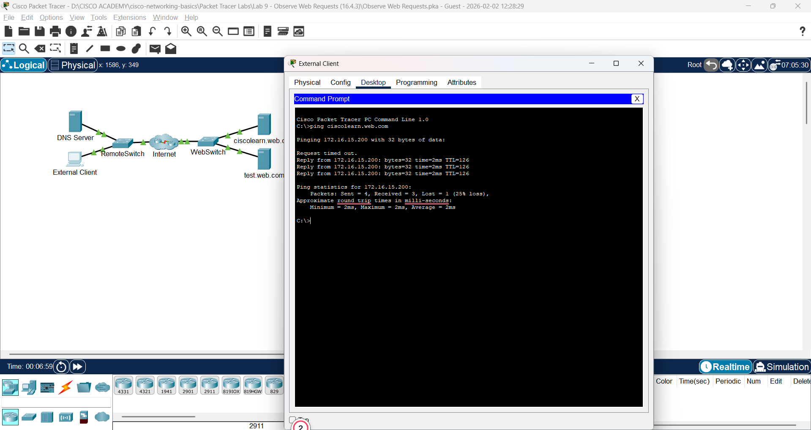
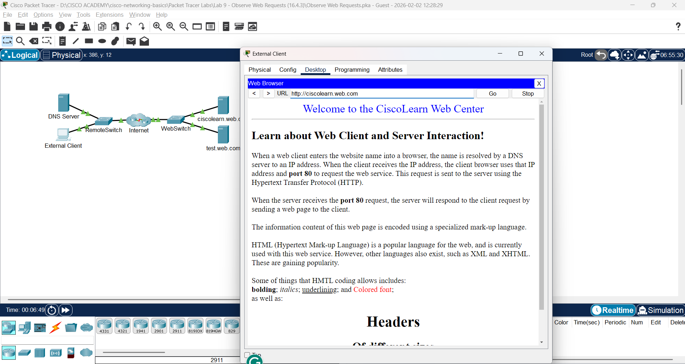
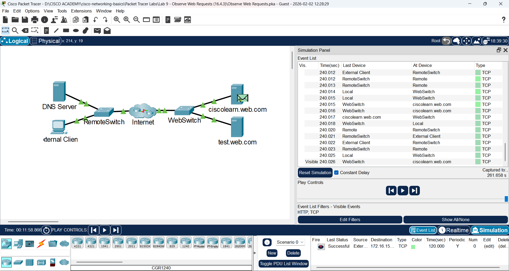

# Lab 9: Amati Permintaan Web (Observe Web Requests)

**Module:** 16 (Application Layer Services)  
**Topik:** 16.4.3  
**Status:** ✅ Selesai

---

## � Screenshots

| Screenshot | Deskripsi |
|------------|-----------|  
|  | Ping URL ke web server via DNS |
|  | Halaman web terbuka di browser |
|  | Complex PDU dan traffic observation |

---

## �📌 Tujuan Lab

- Melihat traffic client/server saat PC request web services
- Memahami proses DNS resolution sebelum HTTP
- Mengamati overhead TCP dalam HTTP communication
- Menggunakan Complex PDU di Simulation Mode

---

## 🔧 Hasil Praktik

### Part 1: Verifikasi Koneksi ke Web Server

**Langkah:**
1. Klik **External Client** → Desktop → **Command Prompt**
2. Ping URL web server:

```
PC> ping ciscolearn.web.com

Pinging 10.10.10.2 with 32 bytes of data:

Reply from 10.10.10.2: bytes=32 time<1ms TTL=128
Reply from 10.10.10.2: bytes=32 time<1ms TTL=128
Reply from 10.10.10.2: bytes=32 time<1ms TTL=128
Reply from 10.10.10.2: bytes=32 time<1ms TTL=128
```

**Poin Penting:**
- IP address `10.10.10.2` diperoleh dari **DNS server**
- DNS resolve domain name → IP address
- Semua traffic di network menggunakan **source & destination IP**

---

### Part 2: Koneksi ke Web Server

**Langkah:**
1. Buka **Web Browser** dari Desktop
2. Ketik URL: `ciscolearn.web.com`
3. Halaman web ditampilkan

**Hasil:** Browser berhasil menampilkan halaman web dari server

---

### Part 3: Lihat Kode HTML

**Langkah:**
1. Klik server **ciscolearn.web.com**
2. Klik tab **Services** → **HTTP**
3. Klik **(edit)** di sebelah file `index.html`

**Perbandingan:**

| Di Server | Di Browser |
|-----------|------------|
| HTML markup code | Rendered web page |
| `<html><head>...` | Tampilan visual |
| Raw text dengan tags | Formatted content |

**Kesimpulan:** Browser membaca HTML code dan me-render menjadi tampilan visual yang user-friendly.

---

### Part 4: Amati Traffic Client ↔ Server

#### Step 1: Masuk Simulation Mode
- Klik tab **Simulation** (kanan bawah)
- Double-click Simulation Panel untuk unlock

#### Step 2: Atur Filter
1. Klik **Edit Filters**
2. Tab **Misc** → centang hanya:
   - ✅ TCP
   - ✅ HTTP

#### Step 3: Buat Complex PDU
1. Klik icon **envelope** (Add Complex PDU)
2. Klik **External Client** sebagai source

#### Step 4: Konfigurasi Complex PDU

| Setting | Value |
|---------|-------|
| Select Application | **HTTP** |
| Destination | **ciscolearn.web.com** (10.10.10.2) |
| Starting Source Port | **1000** |
| Simulation Settings | **Periodic Interval: 120 seconds** |

5. Klik **Create PDU**

#### Step 5: Jalankan Simulasi
1. Klik **Play** di Simulation Panel
2. Percepat animasi dengan slider
3. Klik **View Previous Events** saat buffer full

---

## 📊 Analisis Traffic

**Event List menunjukkan banyak packet:**

| # | Event | Protocol | Deskripsi |
|---|-------|----------|-----------|
| 1 | TCP SYN | TCP | Connection establishment |
| 2 | TCP SYN-ACK | TCP | Server acknowledge |
| 3 | TCP ACK | TCP | Connection established |
| 4 | HTTP GET | HTTP | Request halaman web |
| 5 | TCP ACK | TCP | Acknowledge request |
| 6 | HTTP Response | HTTP | Server kirim data |
| 7 | TCP ACK | TCP | Acknowledge data |
| ... | ... | ... | ... |

**Kenapa banyak packet?**

HTTP menggunakan **TCP** yang membutuhkan:
- **Connection establishment** (3-way handshake)
- **Acknowledgement** untuk setiap data
- **Connection termination**

Ini menambah **overhead** tapi menjamin **reliability**.

---

## 📈 Perbandingan: TCP vs UDP untuk Web

| Aspek | TCP (HTTP) | UDP |
|-------|------------|-----|
| Connection | Required (3-way handshake) | Tidak perlu |
| Acknowledgement | Setiap packet di-ACK | Tidak ada |
| Reliability | ✅ Guaranteed delivery | ❌ Best effort |
| Overhead | Tinggi (banyak packet) | Rendah |
| Use Case | Web, Email, File transfer | Streaming, Gaming, DNS |

---

## 💡 Pemahaman & Poin Penting

### Konsep Utama:

1. **DNS resolution** terjadi sebelum HTTP request
2. **ping** ke URL → DNS resolve dulu ke IP
3. **HTTP = TCP** → connection-oriented, reliable
4. **Banyak packet** karena TCP overhead (SYN, ACK, dll)
5. **HTML code** di server → rendered di browser

### Traffic Flow untuk 1 Web Request:

```
┌────────────────┐                    ┌──────────────┐
│ External Client│                    │  Web Server  │
└───────┬────────┘                    └──────┬───────┘
        │                                    │
        │ ──── TCP SYN ────────────────────► │
        │ ◄─── TCP SYN-ACK ────────────────  │
        │ ──── TCP ACK ────────────────────► │
        │        (Connection Established)    │
        │                                    │
        │ ──── HTTP GET /index.html ───────► │
        │ ◄─── TCP ACK ───────────────────── │
        │ ◄─── HTTP 200 OK + HTML ─────────  │
        │ ──── TCP ACK ────────────────────► │
        │                                    │
        │ ──── TCP FIN ────────────────────► │
        │ ◄─── TCP FIN-ACK ────────────────  │
        │        (Connection Closed)         │
```

### Kesimpulan:
- **1 HTTP request** = **banyak TCP packets**
- TCP menjamin data sampai lengkap
- Trade-off: reliability vs speed
